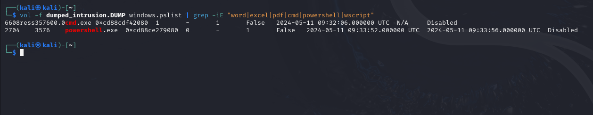
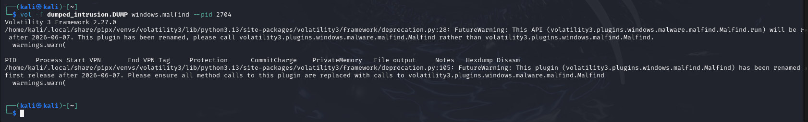
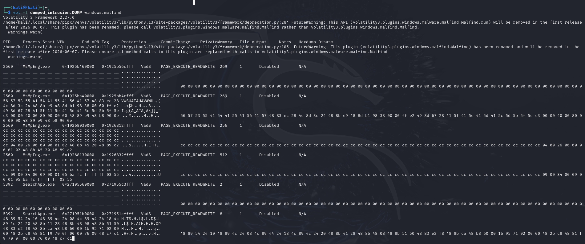
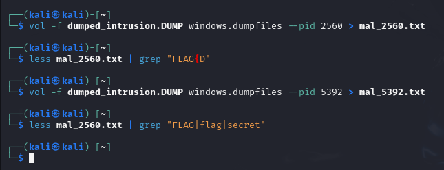
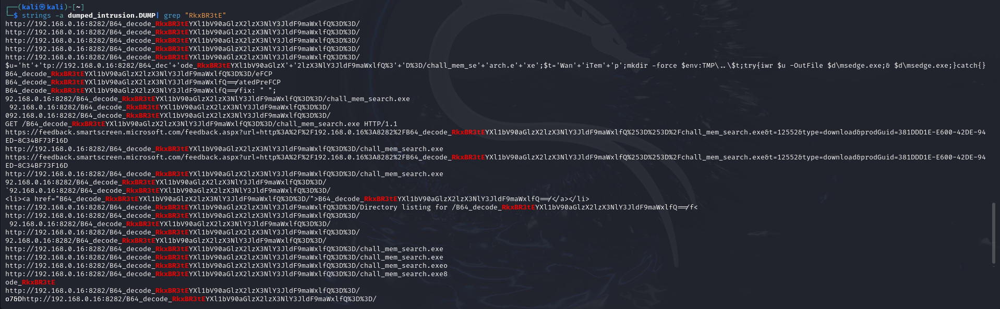
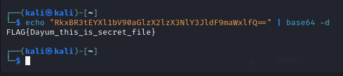

# dump_intrusion
---

## 1. Điều tra tiến trình

Trong mô tả có nêu hệ thống hoạt động bất thường ngay sau khi một file chưa biết được mở, ta liệt kê các ứng dụng phổ biến bằng lệnh:

```
vol -f dumped_intrusion.DUMP windows.pslist | grep -iE "word|excel|pdf|cmd|powershell|wscript"
```


Tìm thấy các tiến trình:
- cmd.exe
- powershell.exe (tồn tại ~4 giây)

PowerShell khởi động rồi tắt nhanh --> Hành vi kì lạ đáng chú ý

---

## 2. Điều tra Injection
Sử dụng plugin malfind của volatility3 để quét các vùng memory có quyền nguy hiểm (EXECUTE_READWRITE) hay có dấu hiệu của shellcode

```
vol -f dumped_intrusion.DUMP windows.malfind --pid 2704
```



Tuy nhiên không thấy dấu hiệu bất thường. Ta tiếp tục dùng malfind quét toàn bộ DUMP



Thấy có 2 process được dump ra với PID lần lượt là 2560 và 5392, bằng mắt thường ta nhận thấy rằng không có gì đặc biệt ngoài mấy ký tự rời rạc không đọc được, cũng không nhận thấy có dấu hiệu gì của mã hóa
Ta tiến hành dump các file được load vào tiến trình này và dùng grep để tìm những file đáng nghi nhưng kết quả không có gì:

```
vol -f dumped_intrusion.DUMP windows.dumpfiles --pid 2560 > mal_2560.txt
less mal_2560.txt | grep "FLAG|flag|secret"
vol -f dumped_intrusion.DUMP windows.dumpfiles --pid 5392 > mal_5392.txt
less mal_5392.txt | grep "FLAG|flag|secret"
```


Kết luận:
- Các entry này chỉ là shellcode bình thường (opcodes, padding)
- Không có chuỗi đọc được đáng chú ý
--> Chuyển hướng sang detect pattern của flag. Có khả năng flag đã bị encode hoặc làm thay đổi cấu trúc.

---

## 3. Mò Flag dựa trên gợi ý

Theo bài, flag thật sự bắt đầu bằng: **FLAG{D**

Chuỗi Base64 của FLAG{D: **RkxBR3tE**

Tìm trong file DUMP:

```
strings -a dumped_intrusion.DUMP | grep "RkxBR3tE"
```


Kết quả tìm thấy rất nhiều vị trí có chuỗi Base64 bắt đầu bằng "RkxBR3tE":

http://192.168.0.16:8282/B64_decode_RkxBR3tE...

Sau khi chọn lọc, ta có nguyên dãy Base64 decode: **RkxBR3tEYXl1bV90aGlzX2lzX3NlY3JldF9maWxlfQ==**

---

## 5. Giải mã

Giải mã đoạn Base64 vừa tìm được, dùng lệnh:

```
echo "RkxBR3tEYXl1bV90aGlzX2lzX3NlY3JldF9maWxlfQ==" | base64 -d
```



Result:

**FLAG{Dayum_this_is_secret_file}**

Lúc đầu nghĩ là chỉ ra cái flag mồi FLAG{H... thôi mà ai ngờ ra luôn flag thật của đề :)))
