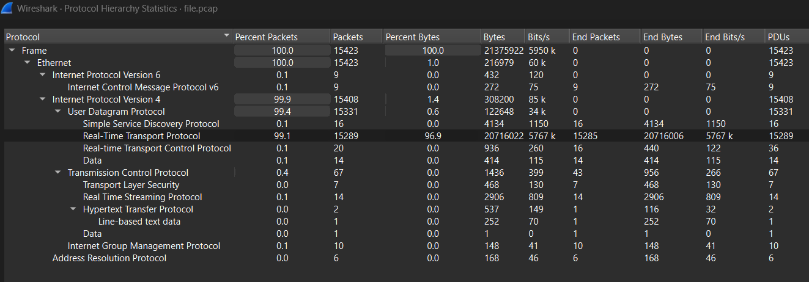
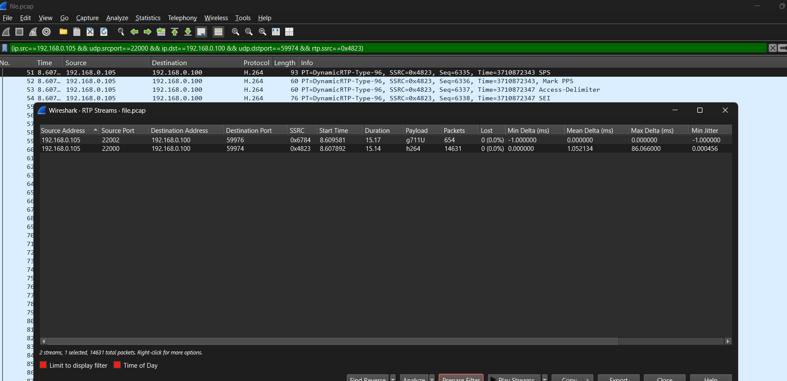
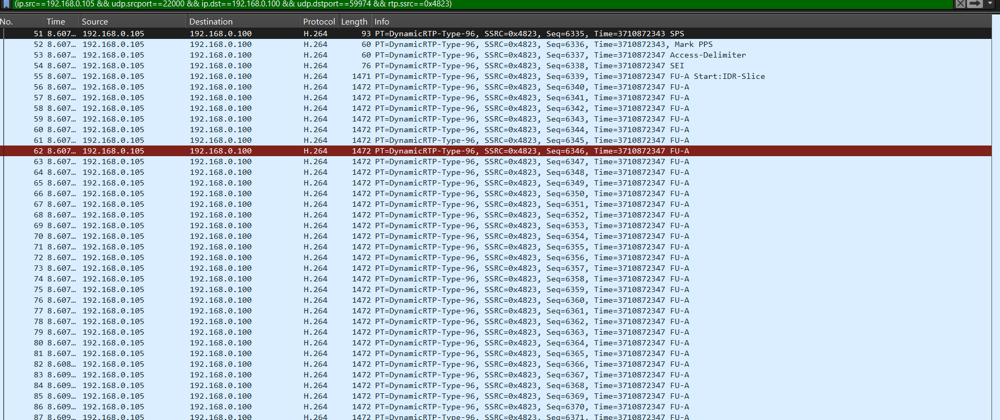
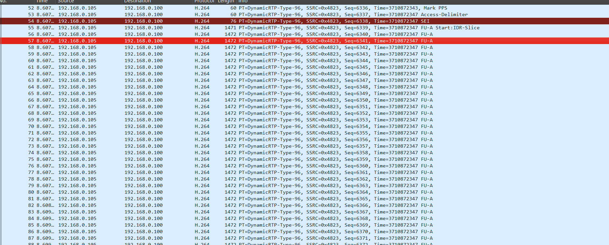
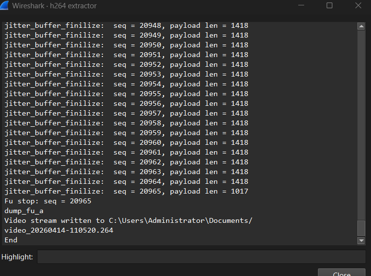
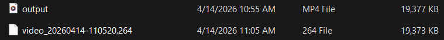
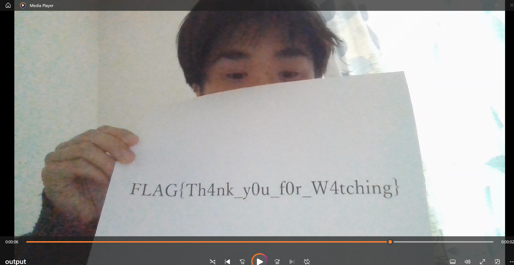

# late night live
Vào `statistics ->  protocol hierachy` để xem giao thức chiếm nhiều bytes nhất.

Ta thấy ở đây RTP trên nền UDP chiếm phần trăm lớn nhất
Tải plugin h264extractor từ https://github.com/volvet/h264extractor/blob/master/rtp_h264_extractor.lua
Vào `Telephony > RTP > RTP Streams` rồi lọc luồng RTP có nhiều packets nhất.

Cột info cho thấy `PT=DynamicRTP-Type-96`.
`Edit > Preferences > Protocols > H264`, tìm ô H264 dynamic payload types và nhập số 96 để lấy các packets hiện giao thức H.264

Vào `Tools > Extract h264 stream from RTP` để extract file h.264

Dùng `ffmpeg -i video_20260414-105448.264 -c copy output.mp4` để đổi sang định dạng .mp4

Mở file .mp4:

Flag: FLAG{Th4nk_y0u_f0r-W4tching}