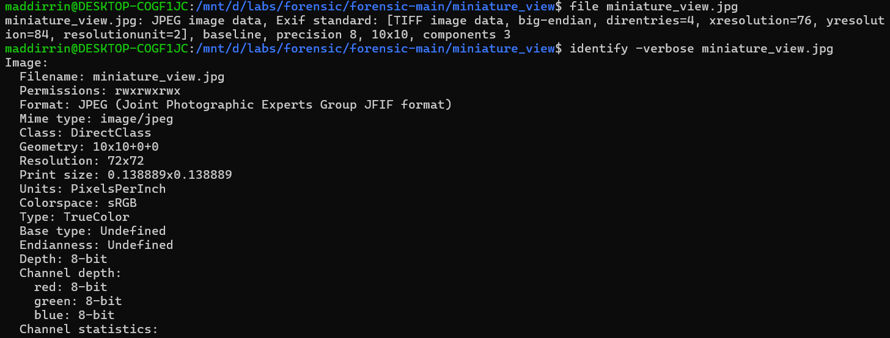
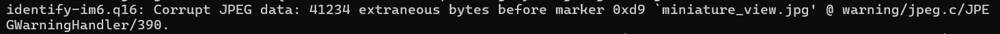
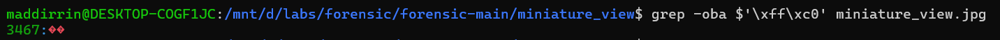
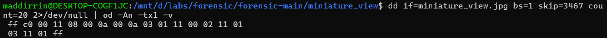
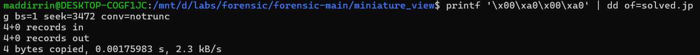
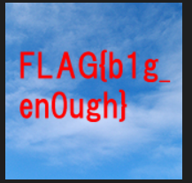

# Miniature view
Chạy:
```bash
file miniature_view.jpg
identify -verbose miniature_view.jpg
```


File báo là 10x10 nhưng kích thước 45KB, identify báo `Corrupt JPEG data`
Một ảnh JPEG 10x10 rất nhỏ không cần tới 45KB -> data nén bên trong rất nhiều.

SOF0 là nơi chứa: precision, height, width, số component
Tìm marker SOF0 trong JPEG:

Ta thấy offset: `3467`
Đọc bytes quanh SOF0:

Giải mã đoạn này:
* `ff c0` = SOF0
* `00 11 `= length
* `08 `= precision
* `00 0a` = height = 10
* `00 0a` = width = 10
* `03` = 3 components
4 bytes cần sửa là: `00 0a 00 0a`
Ở bài này, giá trị đúng là 160x160, tức hex là: 160 = `0x00a0`
Ta thay `00 0a 00 0a` thành `00 a0 00 a0`:

Vì: SOF0 ở offset 3467, height bắt đầu tại 3467 + 5 = 3472
Kết quả:

Flag: `FLAG{b1g_en0ugh}`