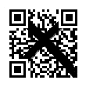

# QR Fragments

## 1. Tổng quan
- **Mô tả**: "The QR code did not survive intact, but its pieces may still reveal the hidden message" (Mã QR không còn nguyên vẹn, nhưng những mảnh ghép của nó vẫn có thể tiết lộ thông điệp ẩn giấu).
- **File cung cấp**: `qr_fragments.png`

## 2. Phân tích hình ảnh
- **Kích thước ảnh**: 111x111 pixels.
- **Tình trạng**: Ảnh bị một dấu X đen lớn đè lên hoặc thực chất là một khoảng trống lớn ngăn cách 4 mảnh tam giác, gây ra sự lệch trục giữa các phần của mã QR.

## 3. Các bước giải quyết
### Khôi phục thủ công
Cách tiếp cận nhanh nhất là sử dụng một công cụ chỉnh sửa ảnh đơn giản như Microsoft Paint hoặc Photoshop để tái tạo lại cấu trúc cơ bản của QR.

1. **Xác định Finder Patterns**: Mã QR cần ít nhất 3 hình vuông định vị lớn (gọi là Finder Patterns) ở góc Trên-Trái, Trên-Phải và Dưới-Trái để máy quét có thể nhận diện. Đây là 3 ô vuông quan trọng nhất trong mã QR, giúp máy quét xác định vị trí và hướng của mã QR.
2. **Căn chỉnh lại**: 
    - Dấu X đã làm lệch vị trí của các finder patterns này.
    - Chỉnh sửa thủ công các pixel bị lỗi tại vị trí tiếp giáp giữa các mảnh sao cho các hình vuông định vị trở nên vuông vức và rõ nét.
3. **Quét mã**: Sau khi 3 Finder Patterns được khôi phục ổn định, quét mã QR đó.

**Flag:** `FLAG{How_scan-dalous}`